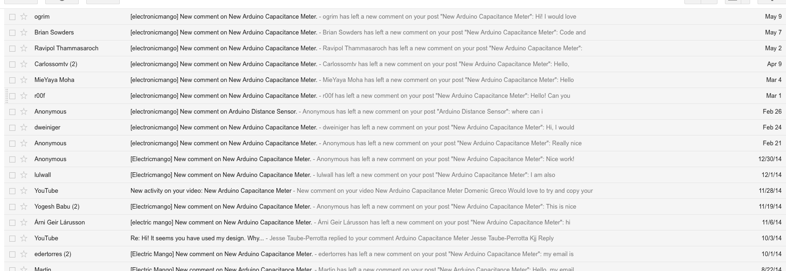

#New Arduino Capacitance Meter
by electricmango

<http://electricmango.github.io>

---

This code is just an _edit_ of some code from a tutorial on the [Arduino website](http://arduino.cc") called [CapacitanceMeter](http://www.arduino.cc/en/Tutorial/CapacitanceMeter) for the ```LiquidCrystal``` library. It really isn't that much.

I came to release this code due to high demand.



To all the poeple that waited forever for this code: **I'm truly sorry ;(**

For a detailed schematic and original code (which uses the serial port): <http://arduino.cc/it/Tutorial/CapacitanceMeter>

Thanks for waiting.